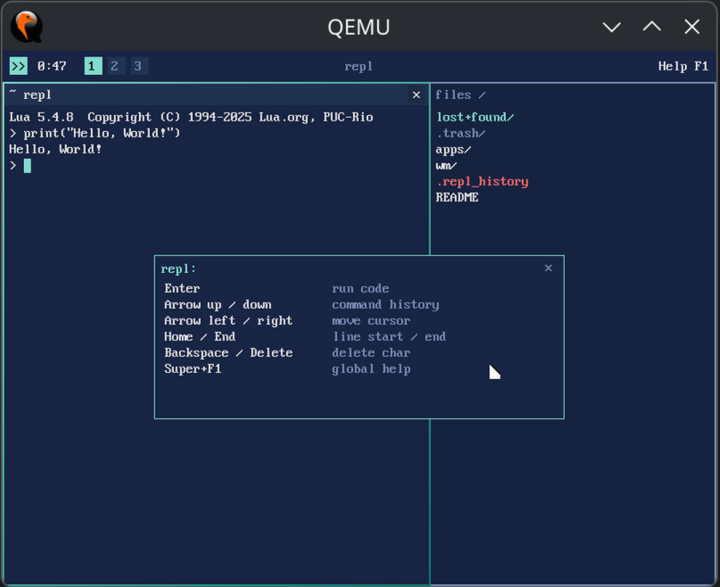

# Aster OS

[](spec/roadmap.md)
[](.version)
[](spec/roadmap.md)
[](.zig-version)
[](spec/architecture.md)
[](libs/limine)
[](libs/lua-5.4)
[](LICENSE)

> **Aster OS is an experimental desktop operating system written in Zig.**
>
> Aster currently targets **x86_64** (QEMU `q35`) — the only implemented architecture for
> now. A future port (e.g. ARM, RISC-V) is not excluded by design, but it is not a goal
> today and would need its own scope change (see [`spec/non-goals.md`](spec/non-goals.md)).
> The first implementation deliberately favors **simplicity over isolation**: the desktop,
> scripting engine, and runtime share a single address space to minimize complexity and
> maximize iteration speed. The public interfaces are designed as **stable abstractions**,
> so individual subsystems can later be moved into isolated processes **without changing
> application APIs**.

> Full manifesto (including what Aster is NOT and accepted trade-offs):
> [`spec/manifest.md`](spec/manifest.md).

## Preview



## Boot proof of work

Booting is the work, the log is the proof. The always-current boot log (with
date, host, accelerator and commit metadata) lives in
[`boot-log.md`](boot-log.md), regenerated by `tools/capture-boot.sh`; a
pre-push hook and CI verify it never drifts from the code
(`./tools/capture-boot.sh --check`). A sample is shown on the
[website](https://xelvra.github.io/aster-os/).

## Status

- **M7 (Runtime) — in progress:** wasm apps, multitasking, app isolation.
  Multi-layout keyboard is done (ADR-024, US/CZ switchable at runtime).
- **M0–M6 complete:** boot → memory → CPU → graphics → Lua runtime → desktop shell in
  Lua → disk storage (virtio-blk, GPT, read-only ext2).
- **Bootable-commit rule:** every commit must leave the system runnable in QEMU
  ([`spec/verification.md`](spec/verification.md)).
- **Feature history:** per-milestone details (Added/Fixed) in
  [`CHANGELOG.md`](CHANGELOG.md); metrics in [`spec/roadmap.md`](spec/roadmap.md).
- This is an alpha prototype, not a usable OS yet.

### Milestone metrics

| M | Milestone | Kernel  | First Frame |
|---|-----------|--------:|------------:|
| M0 | Boot      |  12 KiB | ≈ 0.3 s |
| M1 | Memory    |  17 KiB | ≈ 0.4 s |
| M2 | CPU       |  29 KiB | ≈ 0.5 s |
| M3 | Graphics  |  34 KiB | ≈ 0.6 s |
| M4 | Lua       | 336 KiB | ≈ 60 ms |
| M5 | UI        | 371 KiB | ≈ 24 ms |
| M6 | Storage   | 362 KiB | ≈ 26 ms |

Boot times from `tools/bench.sh` — M0–M3 wall-clock incl. the bootloader,
M4+ kernel-only on KVM.

## Quick start

```bash
zig build run          # boot in QEMU (auto KVM when /dev/kvm is available)
zig build run -Dkvm=false  # force TCG emulation
zig build test         # host unit tests
```

Persistent disk (M7.1): without a disk the filesystem is not mounted and the
editor/file browser cannot open anything.

```bash
./tools/make-test-disk.sh disk.img   # 16 MiB GPT + ext2 test disk (theme.lua, README, apps/)
zig build run -Ddisk=disk.img        # boot with the disk attached
```

In the shell: **Super+T** opens the editor on `theme.lua` (arrows move the
cursor/line, **Ctrl+S** saves and the shell repaints live); **Super+E** opens
the file browser at the root (Up/Down select, **Enter** opens/edits a file,
**Space** previews, **Delete** removes it, Escape or a click on the path
header goes up a level; hidden
dotfiles like the `.theme.bak` config backup are shown in dim gray).
**Super+Space** opens the launcher; Alt+Tab cycles windows. The WM follows
**Hyprland conventions strictly** — shortcuts, buttons and navigation behave
the same as in Hyprland (`spec/desktop-ui.md` §5).

`theme.lua` is full Lua code (not a data format), so you can tweak colors and
geometry or rewrite window behavior — the shell applies it atomically on
save. A broken config is reported in the REPL and the last valid look stays:
`.theme.bak` holds the last working version as a read-only fallback and
cannot be deleted while `theme.lua` is broken.

Verification tools (see [`spec/verification.md`](spec/verification.md)):

```bash
./tools/qemu-smoke.sh  # automated boot test (serial marker + timeout; auto KVM)
./tools/qemu-test.sh   # in-QEMU runtime tests (isa-debug-exit; auto KVM)
./tools/verify-reproducible.sh  # deterministic build check (ADR-014)
```

Build modes (default is `ReleaseSafe`, the verified production mode):
`zig build -Doptimize=ReleaseFast` trades safety checks for ~20 % smaller
image and faster execution; `-Doptimize=Debug` for debugging. The Lua C
sources are always compiled with `-Os` regardless of the mode.

## Prerequisites

- **Zig** — exact version in [`.zig-version`](.zig-version) (0.16.0), not a distro package.
- **QEMU** (`qemu-system-x86_64`) — target emulation.
- **Build tools:** xorriso / mtools; Limine and Lua 5.4.8 are vendored in `libs/`.

Full tool table and dependency status: [`spec/verification.md`](spec/verification.md) §6.

## Architecture at a glance

```
BIOS/UEFI → Limine → Zig kernel (Ring 0) → KI (api/*) → Lua shell / Wasm apps
```

The kernel, KI, runtimes, and the full diagram live in
[`spec/architecture.md`](spec/architecture.md) §3.

## Documentation

- **Public website:** the English documentation site lives at
  [xelvra.github.io/aster-os](https://xelvra.github.io/aster-os/) — a curated,
  stable public layer over the internal spec (see the two-layer strategy in
  [`spec/README.md`](spec/README.md)).
- **Internal specification:** the complete architecture spec lives in
  [`spec/`](spec/README.md). Start with the [architecture overview](spec/architecture.md).

The internal specs are written in Czech by design — this is the author's working
documentation, not marketing; see the language policy in
[`spec/README.md`](spec/README.md).

If the system crashes or hangs: [`spec/debugging.md`](spec/debugging.md)
(Debugging Survival Guide) and [`spec/troubleshooting.md`](spec/troubleshooting.md)
(known pitfalls).

## Roadmap

| Milestone | Goal |
|-----------|------|
| M0 ✅ | Boot: deterministic build, boots in QEMU, serial marker |
| M1 ✅ | Memory: PFA + heap allocator |
| M2 ✅ | CPU: IDT, APIC timer, IOAPIC†, PS/2 keyboard |
| M3 ✅ | Graphics: framebuffer, renderer, text on screen |
| M4 ✅ | Lua: interactive REPL in kernel, hot reload |
| M5 ✅ | UI: desktop shell in Lua — tiling WM, bar, launcher, workspace, mouse, error containment, live transformation |
| M6 ✅ | Storage: initfs, virtio-blk, GPT, filesystem, cooperative reads |
| M7 🔄 | Runtime: wasm apps, multitasking, app isolation |
| M8 ⏳ | Stabilization: invariant audit, metrics, Ring 3 decision |
| M9 ⏳ | Ecosystem: network, audio, browser, WASI |
| M10 ⏳ | Adoption: real hardware, installable image, docs, contributors |

† I/O APIC address is discovered from ACPI/MADT (`src/kernel/cpu/acpi.zig`); the
fixed `0xFEC00000` stays only as a fallback (see [`spec/non-goals.md`](spec/non-goals.md)).

Details in [`spec/roadmap.md`](spec/roadmap.md).

## Community & Security

- **Contributing:** [`CONTRIBUTING.md`](CONTRIBUTING.md) — project state, what to
  read first, how changes are expected to land.
- **Code of Conduct:** [`CODE_OF_CONDUCT.md`](CODE_OF_CONDUCT.md).
- **Security policy:** [`SECURITY.md`](SECURITY.md) — Aster is alpha software with
  no process/memory isolation (single address space, Ring 0); read this before
  treating it as anything other than experimental.

## License

MIT — see [LICENSE](LICENSE). Third-party components (Limine, Lua, vendored fonts,
and thematic inspirations) carry their own licenses and are recorded separately in
[`THIRD-PARTY-NOTICES.md`](THIRD-PARTY-NOTICES.md).
